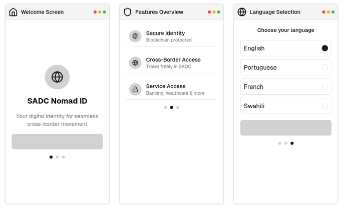

SADC Nomad ID
A cross-border digital identity solution for migrants in Southern Africa, providing secure, verifiable, and interoperable identification to access essential services across SADC countries.

SADC Nomad ID

Overview
SADC Nomad ID addresses the challenges faced by millions of undocumented migrants in Southern Africa who struggle with legal and economic barriers due to lack of recognized identification. This digital ID system leverages blockchain technology, biometrics, and AI-powered verification to create a secure and portable identity that works across borders.

Problem Statement
Millions of undocumented migrants in Southern Africa face:

Limited access to employment, education, healthcare, and financial services
Inability to legally contribute to national economies
Vulnerability to exploitation and economic exclusion
Challenges with fragmented national ID systems that lack interoperability
Solution
SADC Nomad ID provides:

A blockchain-secured digital identity recognized across SADC countries
Biometric verification for secure, fraud-proof identification
Legal framework for accessing essential services
Ability to work legally and contribute to national economies
Seamless cross-border movement within legal frameworks
Features
Secure Digital ID: Blockchain-protected identity with unique ID number
Biometric Authentication: Facial recognition and fingerprint verification
Cross-Border Recognition: ID works across all SADC member states
Service Access:
Banking and financial services
Employment verification
Healthcare access
Education services
Border Crossing: Pre-registration for border crossings
Activity Tracking: Monitor ID usage and verification history
Technology Stack
Frontend: Next.js, React, TypeScript
Styling: Tailwind CSS, shadcn/ui components
Authentication: Biometric verification (simulated)
Data Storage: Blockchain technology (simulated)
Icons: Lucide React
Getting Started
Prerequisites
Node.js (v18.x or later)
npm or yarn
Git
Installation

1. Clone the repository:

```
git clone https://github.com/your-username/sadc-nomad-id.git

cd sadc-nomad-id
```

2. Install dependencies:

```shellscript
npm install
# or
yarn install
```


3. If you encounter dependency conflicts, use:

```shellscript
npm install --legacy-peer-deps
# or
yarn install --ignore-engines
```


4. Start the development server:

```shellscript
npm run dev
# or
yarn dev
```


5. Open [http://localhost:3000](http://localhost:3000) in your browser to see the application.


## Project Structure

```plaintext
sadc-nomad-id/
├── app/
│   ├── dashboard/
│   │   └── page.tsx         # Main dashboard
│   ├── register/
│   │   └── page.tsx         # Registration flow
│   ├── travel/
│   │   └── page.tsx         # Border crossing
│   ├── services/
│   │   ├── page.tsx         # Services dashboard
│   │   ├── banking/
│   │   │   └── page.tsx     # Banking services
│   │   ├── employment/
│   │   │   └── page.tsx     # Employment verification
│   │   ├── healthcare/
│   │   │   └── page.tsx     # Healthcare services
│   │   ├── education/
│   │   │   └── page.tsx     # Education services
│   │   └── request/
│   │       └── page.tsx     # Request new service
│   ├── login/
│   │   └── page.tsx         # Login screen
│   ├── globals.css          # Global styles
│   ├── layout.tsx           # Root layout
│   └── page.tsx             # Welcome/onboarding screens
├── components/
│   └── ui/                  # UI components (shadcn/ui)
├── public/                  # Static assets
├── tailwind.config.ts       # Tailwind configuration
├── next.config.js           # Next.js configuration
├── package.json             # Dependencies and scripts
└── README.md                # Project documentation
```

## Usage

### User Flow

1. **Welcome & Onboarding**:

1. Introduction to SADC Nomad ID
2. Features overview
3. Language selection


2. **Registration**:

1. Document scanning
2. Biometric capture (fingerprints)
3. Facial recognition
4. Personal information


3. **Dashboard**:

1. View ID status and information
2. Access recent activity
3. Navigate to services


4. **Services**:

1. Banking: Connect accounts, access financial services
2. Employment: Share work eligibility, manage permits
3. Healthcare: Access medical services, view appointments
4. Education: Verify qualifications, access institutions


5. **Travel**:

1. Pre-register border crossings
2. Select countries and border posts
3. Specify travel purpose


## Screenshots

### Welcome & Onboarding




### Registration


<!--
### Dashboard


 -->


### Services


## Development

### Building for Production

```shellscript
npm run build
# or
yarn build
```

### Running in Production Mode

```shellscript
npm start
# or
yarn start
```

## Future Enhancements

- Integration with actual blockchain technology
- Real biometric hardware support
- API connections to government databases
- Multi-language support for all SADC languages
- Offline functionality for areas with limited connectivity
- Mobile app versions for iOS and Android


## Contributing

Contributions are welcome! Please feel free to submit a Pull Request.

1. Fork the repository
2. Create your feature branch (`git checkout -b feature/amazing-feature`)
3. Commit your changes (`git commit -m 'Add some amazing feature'`)
4. Push to the branch (`git push origin feature/amazing-feature`)
5. Open a Pull Request


## License

This project is licensed under the MIT License - see the LICENSE file for details.

## Acknowledgements

- [MOSIP](https://www.mosip.io/) - Modular Open-Source Identity Platform
- [Next.js](https://nextjs.org/) - The React Framework
- [Tailwind CSS](https://tailwindcss.com/) - A utility-first CSS framework
- [shadcn/ui](https://ui.shadcn.com/) - Re-usable components
- [Lucide Icons](https://lucide.dev/) - Beautiful & consistent icons


## Contact

Project Link: [https://github.com/your-username/sadc-nomad-id](https://github.com/your-username/sadc-nomad-id)

```plaintext

```
